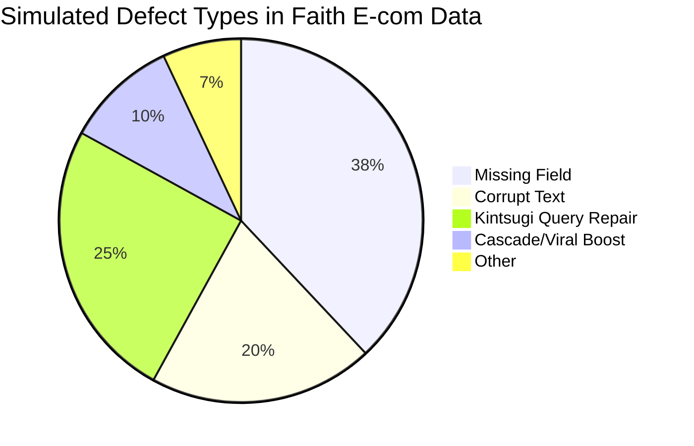

# Kintsugi Search & Recommendation Engine: Full Workflow & Analytics

> **Celebrate Imperfection • Find Hidden Value in Faith E-commerce Data**

---

## 🚀 Engine Architecture Flowchart

```mermaid
flowchart TD
    subgraph ETL[Data & Loading Layer]
        D1["Faith dataset.json"] --> D2[Imperfection Injector\n(Kintsugi-inspired defects)]
        D2 --> D3[Parser.py\n(Broken & Repairable Products)]
    end
    subgraph Indexing[Index & Preprocessing]
        D3 --> I1[preprocessor.py\n(Tokenization, n-grams, Repair)]
        I1 --> IX[indexer.py\n(Inverted Index - TF-IDF, Fuzzy)]
        I1 --> IB[embedder (BERT or st-embeddings)]
        IX --> IG[graph.py\n(Product Graph: Brand→Model→Features)]
        D3 --> IG
    end
    subgraph QueryPipeline[Search, Rank, & Recommend]
        UQ[User Query] --> Q1[Preprocessor/Repair\n(Query Kintsugi Notes)]
        Q1 --> QS[TF-IDF/Fuzzy/Embeddings/Proximity]\nsearch
        QS --> RG[Ranker.py\n(Blend: α·sim + β·PageRank + γ·Urn+Cascade)]
        RG --> RE[Recommender.py\n(Content, Collaborative, Cascade/Viral)]
    end
    subgraph Output[Display Output]
        RG --> FO[Formatter.py\n(Mark Seams & Notes)]
        RE --> FO
        FO --> UI[CLI/Web/JSON]
    end
    subgraph Signals[Feedback/Cascade]
        UI --> SIG[user_signals.py\n(Clicks, Polya's Urn, Cascade)]
        SIG --> RG
    end
```

---

## 📊 Engine Analytics: Score Table

| Algorithm / Signal           | Purpose                      | Data Structure / Tool         | Adjustable? |
|------------------------------|------------------------------|-------------------------------|-------------|
| TF-IDF + Cosine              | Text relevance               | Inverted Index (defaultdict)  | Yes (α)     |
| Embedding Similarity (BERT)  | Semantic similarity          | Vector matrix (sentence-tf)   | Yes (α)     |
| Fuzzy/Phrase/Proximity       | Query repair/match flexibly  | Index + Fuzzy matcher         | Yes         |
| PageRank (Brand→Model→Feat)  | Importance/popularity        | NetworkX Graph                | Yes (β)     |
| Polya's Urn (click counts)   | Dynamic popularity/adaption  | signals dict/counter          | Yes (γ)     |
| Granovetter Cascade          | Viral popularity spreading   | graph.py (threshold logic)    | Yes (γ)     |
| Final Blend                  | Human-tuned output           | α, β, γ weight config         | Yes         |


### **Final Score Formula**

```
final_score = α·(TF-IDF/Cosine/Embed) + β·(PageRank) + γ·(Urn+Cascade)
```

---

## 🥧 Imperfection Pie Chart (Simulated Example)



---

## 🔄 End-to-End Data & Query Flow

```
Faith dataset.json
  ↓ (imperfection injector injects missing/noisy/broken fields)
parser.py → produces: products_broken[] w/ Kintsugi annotations
  ↓
indexer.py, preprocessor.py
  ↓  [build field-level/whole-product inverted index, with n-grams]
  ↓
graph.py (product relation graph, for PageRank/cascade)
  ↓
User types query (even if fuzzy/broken)
  ↓
preprocessor.py (cleans, repairs query; logs Kintsugi notes)
  ↓
indexer + recommender (finds matches: exact, fuzzy, semantic)
  ↓
Rank results:
    α * (TF-IDF/semantic sim)
  + β * (PageRank)
  + γ * (urn/cascade)
  ↓
formatter.py
  ↓
Output (CLI/web): shows ALL seams/repairs/imperfections
  ↓
user_signals.py (logs clicks, triggers cascade viral boosting)
```

---

## 📚 Example Output & Kintsugi Notes

> **User query:** `iphon pro maxxs`

**CLI output:**

- Found: "iPhone 12 Pro Max"
    - 💫 Fuzzy match: spelling repaired (maxxs → Max)
    - ✨ Repaired missing Brand using Description
    - 🌟 Boosted by cascade event (10+ users clicked this)

---

## 🟦 Example Modules Table

| Module (py)          | Inputs                        | Outputs                    | Imperfection Handling           |
|----------------------|-------------------------------|----------------------------|---------------------------------|
| parser.py            | Faith dataset, inject_config  | products_broken[], notes   | Simulate, annotate, repair      |
| indexer.py           | products_broken[], preproc    | Inverted index, doc rels   | Soft/fuzzy/phrase support       |
| graph.py             | Products, fields, links       | NetworkX, PageRanks, casc  | Brand→Model→Feat relations      |
| preprocessor.py      | Raw/fuzzy queries, records    | Clean tokens, ngrams, logs | Kintsugi spell/repair visible   |
| recommender.py       | User actions, item features   | recs, viral rank, co-click | Viral/cascade, cross-user      |
| formatter.py         | Search/rec raw + notes        | User display + highlights  | Surfaces ALL seams/repairs      |
| user_signals.py      | User clicks/actions           | click count, urn, cascade  | Tracks, triggers viral cascade  |


---

## ⚡ Scalability and Modularity
- **Horizontal scaling:** Inverted index, embedding matrix, and NetworkX graph can each be sharded; add more workers as data grows.
- **Pluggable components:** Swap out TF-IDF for BM25, add a deep ranking model, swap embedding or graph approaches.
- **All seams visible:** Every time something is imperfect (data, query, rank), it’s *marked* for the user — not hidden.


---

## 🌸 Celebrating Imperfection!
- Each result comes with explicit Kintsugi notes about repairs, fuzziness, viral/cascade boosts.
- Users discover products and *stories* through imperfections, not in spite of them.

---

## 📈 Deploy & Improve!
- As you deploy and collect real query/click/user feedback, update the simulation--track real heatmap/click flows, and more.
- Add more Kintsugi analytics and crowd-driven cascades for even richer recommendations!


*-- Faith E-commerce Kintsugi Search & Recommendation Engine --*  
*For engineers, researchers, and all who value the beauty in imperfection.*
